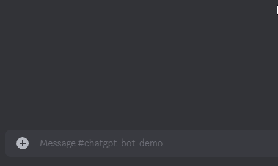

# ChatGPT Discord Bot
Discord bot designed to generate novel responses using ChatGPT

Demonstration
:-----------------------------:

## Setup and Usage
After cloning the repository and installing its dependencies (using `npm install`), create a file called `.env` and populate it with the keys found in `.env.example` and their appropriate values. Once configured, run the bot using `npm run start`.

Ask the bot a question using the `/ask` slash command.
